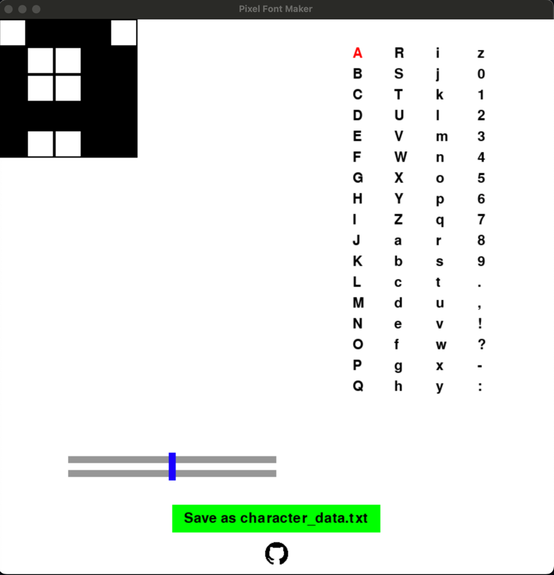

# Pixel-Font-Gen
Just a simple pixel font generator for the repo ["pixoo"](https://github.com/SomethingWithComputers/pixoo) or Divoom Pixo64 or to simply create a 2D flatten array from a matrix.

The made works are saved with click on "Save as character_data.txt" in the character_data.txt. Besides the 2D flatten array, the size of the matrix is also specified here! 

Just try my tool - I am grateful for any idea, suggestion or addition.

**Requirements:**
- numpy
- pygame